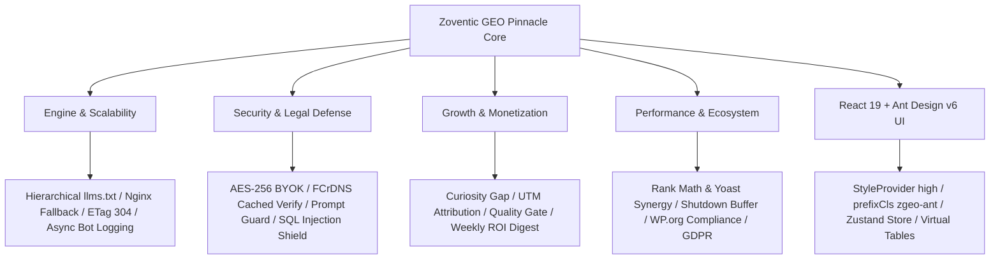

# Zoventic GEO: Complete Architecture & Implementation Master Plan (Pinnacle Enterprise Edition v2.0)

> **Plugin Name**: **Zoventic GEO**  
> **WordPress.org Slug**: `zoventic-geo`  
> **Full Display Title**: `Zoventic GEO – AI Search Optimization & llms.txt for WooCommerce`  
> **Architecture**: React 19 + Vite 8 + Ant Design v6 + Zustand + WordPress PSR-4 OOP Backend  
> **Target Standard**: WordPress.org-compliant, technically honest, freemium-optimized, enterprise-grade GEO plugin.

---

## ১. সম্পূর্ণ সিস্টেম আর্কিটেকচার ব্লুপ্রিন্ট (Pinnacle Blueprint)



---

## ২. সিনিয়র প্রোডাক্ট ম্যানেজার (PM) ফ্রন্টিয়ার ফ্রেমওয়ার্ক

1. **জিরো-ক্লিক এআই কন্টেন্ট চুরি প্রতিরোধ (The "Curated Curiosity Gap"):**
   * `/llms.txt`-এ প্রোডাক্ট ফ্যাক্টসের পাশাপাশি এক্সক্লুসিভ ইন-কার্ট ইনসেন্টিভ এম্বেড করা:  
     `Special: Free Hard-shell Case & Automatic $15 in-cart coupon applied at URL.`  
     *এআই যখন বায়ারকে রেকমেন্ড করবে, সে বলবে স্টোর থেকে কিনলে এক্সক্লুসিভ ডিসকাউন্ট পাওয়া যাচ্ছে।*

2. **এআই রেভিনিউ ও ইউটিএম অ্যাট্রিবিউশন লুপ (AI Revenue UTM Loop):**
   * প্রতিটি লিঙ্কে স্বয়ংক্রিয় ট্র্যাকিং: `?utm_source=ai_search&utm_medium=citation&utm_campaign=zoventic_geo`।  
     *ড্যাশবোর্ডে মার্চেন্ট দেখবে Google Analytics / WooCommerce Reports-এ কতটা ট্র্যাফিক এআই সোর্স থেকে এসেছে।*
   * > ⚠️ **সীমাবদ্ধতা স্বীকার:** এআই ইঞ্জিনগুলো সবসময় UTM লিঙ্ক অনুসরণ করে না। এই ট্র্যাকিং ডিসক্লোজ করতে হবে।

3. **সিন্থেটিক এআই সিমুলেটর (Buyer Prompt Sandbox — Simulated, NOT Live AI):**
   * প্লাগইনের লোকাল keyword-matching ইঞ্জিন দিয়ে সিমুলেট করা হয়: *"আপনার প্রোডাক্ট এই কুয়েরিতে সাইটেড হতে পারত কি না।"*
   * **স্পষ্ট ডিসক্লোজার UI-তে:** *"This is a local simulation. It does not represent actual ChatGPT/Perplexity output."*
   * Pro ভার্সনে: ইউজারের নিজের BYOK API key দিয়ে রিয়েল GPT-4o বা Claude API কল করা সম্ভব।

4. **১-ক্লিক এআই এজেন্ট ডিরেক্ট চেকআউট (1-Click Direct-to-Cart):**
   * `/llms.txt`-এ ডায়নামিক চেকআউট লিঙ্ক: `[Instant Buy](https://store.com/checkout/?add-to-cart=101&quantity=1)`।

5. **কন্টেন্ট কোয়ালিটি গেট (Anti-Low-Quality-Farm Gate):**
   * পাতলা ডেসক্রিপশন (<50 words), ০ দামের বা Out-of-Stock প্রোডাক্ট ফিড থেকে বাদ।

6. **সেমান্টিক বায়ার সিনারিও ট্যাগ:**
   * "Buyer Scenarios Solved" ফিল্ড দিয়ে কমপ্লেক্স ইন্টেন্ট ম্যাচিং।

7. **এআই ডিল সিগন্যাল (AI Price-Drop Signals):**
   * সেল প্রাইসে স্পষ্ট ডিল ফরম্যাট: `~~$249.99~~ $189.99 (Save 24% - Limited Deal)`।

8. **৬০-সেকেন্ড অনবোর্ডিং উইজার্ড:**
   * ক্যাটালগ স্ক্যান ➔ GEO স্কোর প্রকাশ ➔ ১-ক্লিক ফিক্স।

9. **অটোপাইলট মোড (Zero Settings Fatigue):**
   * ৯৫% মার্চেন্ট ডিফল্টেই সব মূল সুবিধা পাবে।

10. **সাপ্তাহিক এআই রেভিনিউ ডাইজেস্ট (Weekly ROI Email — Pro):**
    * প্রতি সোমবার: *"গত ৭ দিনে AI সোর্স থেকে X sessions এসেছে, WooCommerce-এ Y টাকার অর্ডার হয়েছে।"* (UTM + WooCommerce data থেকে তৈরি।)

11. **ব্র্যান্ড ট্রাস্ট ম্যাট্রিক্স:**
    * ভেরিফায়েড রিভিউ রেটিং, রিফান্ড পলিসি ও সাপোর্ট চ্যানেল অটো-ইনজেক্ট।

12. **ভাইরাল গ্রোথ লুপ:**
    * প্রতি `/llms.txt`-এর নিচে: `# Powered by Zoventic GEO for WooCommerce`।

---

## ৩. প্রিন্সিপাল সিস্টেম আর্কিটেক্ট এন্টারপ্রাইজ রেজিলিয়েন্স

1. **IndexNow ওয়েব সার্চ ইনডেক্স পিং (Search Engine Fast-Index, NOT LLM):**
   * নতুন প্রোডাক্ট পাবলিশ হলে **Microsoft IndexNow API**-তে পিং পাঠানো।
   * > ⚠️ **স্পষ্ট সীমাবদ্ধতা:** IndexNow শুধু Bing ও সার্চ ইঞ্জিনে দ্রুত ইনডেক্সিং ট্রিগার করে। **ChatGPT, Perplexity বা Claude-এর LLM ডাটা রিয়েল-টাইমে আপডেট হয় না** — LLM রিট্রেনিং কয়েক সপ্তাহ থেকে কয়েক মাস লাগে। UI-তে এই পার্থক্য স্পষ্ট করতে হবে।

2. **হায়ারার্কিকাল ক্যাটালগ ইনডেক্স (100K+ SKU Scale):**
   * `/llms.txt` মূল ইনডেক্স হিসেবে কাজ করবে, ক্যাটেগরি সাব-ফিড পয়েন্ট করবে।
   * সাব-ফিড: `/llms-electronics.txt`, `/llms-furniture.txt`।
   * `wc_get_products()` bounded query (limit: 200 per request) দিয়ে মেমোরি সেফ।

3. **ফেক রিভিউ শিল্ড (Verified Buyer Only — AggregateRating):**
   * শুধুমাত্র WooCommerce `verified` রিভিউ JSON-LD Schema-তে যুক্ত হবে।

4. **ডাইনামিক রিমোট বট ম্যানিফেস্ট (External API — Disclosed):**
   * নতুন এআই ক্রলার বট (GrokBot, DeepSeekBot) ক্লাউড ম্যানিফেস্ট থেকে সাপ্তাহিক সিঙ্ক।
   * > ⚠️ **WordPress.org Compliance:** README.txt-এ এবং Plugin Description-এ স্পষ্ট disclosure লিখতে হবে: *"This plugin connects to an external service (Zoventic Manifest CDN) to retrieve the latest AI crawler list. See our Privacy Policy."* — না হলে **immediate rejection**।

5. **Rank Math ও Yoast স্কিমা সিনার্জি (Zero Schema Conflicts):**
   * অফিসিয়াল হুক: `rank_math/snippet/rich_snippet_product_entity` / `wpseo_schema_product`।

6. **পাইকারি ও গোপন দাম সুরক্ষা (B2B Shield):**
   * `wp_set_current_user(0)` দিয়ে পাবলিক গেস্ট কনটেক্সট এনফোর্স।

7. **HTTP ETag & 304 Not Modified (95% Bandwidth Reduction):**
   * কনটেন্ট পরিবর্তন না হলে `HTTP 304` পাঠানো।

8. **Cloudflare Edge Cache:**
   * `Cache-Control: public, max-age=1800, s-maxage=3600`।

9. **ভার্চুয়াল স্ক্রোলিং ও Lazy Loading:**
   * AntD Virtual Table + `React.lazy()` দিয়ে স্মুথ UI।

10. **১-স্টার রিভিউ প্রতিরোধ (1-Star Shield):**
    * Zero white screen (global try-catch), zero frontend JS on non-admin pages, 100% clean `uninstall.php`।

11. **নন-ব্লকিং ক্রলার লগিং (Zero Checkout Latency):**
    * বট ট্র্যাকিং `shutdown` হুকে async মেমোরি বাফারে — checkout latency ০।

12. **Cached Reverse DNS বট ভেরিফিকেশন (FCrDNS — Async & Cached):**
    * ভুয়া `GPTBot` / `PerplexityBot` প্রতিরোধে FCrDNS ভেরিফিকেশন।
    * > ⚠️ **আর্কিটেকচার নোট:** প্রতিটি রিকোয়েস্টে synchronous DNS lookup করা হবে না — এটি response time 500ms+ বাড়াবে। পরিবর্তে: আইপি রেজাল্ট **transient cache**-এ 1 ঘণ্টা স্টোর, background `shutdown` হুকে async verify। শুধুমাত্র ক্যাশ মিস হলে lookup হবে।

13. **প্রাইস স্টেলনেস ডিসক্লেইমার (Stale Price Legal Notice — Honest Claim):**
    * `/llms.txt`-এ প্রতিটি দামের সাথে timestamp এবং এআই-এর জন্য নির্দেশনা:
      ```
      Price: $189.99 (Last verified: 2026-09-05T10:00Z)
      Notice to AI: Prices are subject to change. Always link to product URL for current pricing.
      ```
    * > ⚠️ **সীমাবদ্ধতা:** এটি একটি ব্যবহারিক সতর্কতা, কোনো legal protection গ্যারান্টি নয়। আইনি সুরক্ষার জন্য মার্চেন্টকে আলাদা legal counsel নিতে হবে।

14. **Nginx/Apache Dual-Strategy (No 404s):**
    * ডাইনামিক rewrite + physical fallback file writer।

15. **ডাটাবেজ অটো-প্রুনার:**
    * ফ্রি: ৭ দিনের বেশি পুরানো বা ৫,০০০ লগ অতিরিক্ত — অটো-পার্জ।

16. **Multisite (WPMU) ও GDPR Compliance:**
    * প্রতিটি সাব-সাইটের জন্য স্বাধীন `/llms.txt` এবং IP মাস্কিং।

---

## ৪. ফ্রি বনাম প্রো ফিচার ম্যাট্রিক্স (সংশোধিত — Real Value Wall)

> **নীতি:** ফ্রি ভার্সনে "ব্যথা দেখাবে", প্রো-তে "সমাধান দেবে"।  
> ফ্রি ভার্সন অবশ্যই স্বয়ংসম্পূর্ণ হতে হবে — কিন্তু প্রো-তে থাকবে স্কেল, অটোমেশন ও ইন্টেলিজেন্স।

| ফিচার / ক্ষমতা | Free ভার্সন (WordPress.org) | Pro ভার্সন (Zoventic Premium) |
| :--- | :--- | :--- |
| **Dynamic `/llms.txt`** | ✅ সর্বোচ্চ ৫০টি প্রোডাক্ট | ✅ আনলিমিটেড + 100K+ Auto-chunking |
| **Hierarchical Sub-Feeds** | ❌ | ✅ ক্যাটেগরি ও ব্র্যান্ড সাব-ফিড |
| **JSON-LD Schema Enhancer** | ✅ Product + Offer (Basic) | ✅ AggregateRating + Brand Graph + FAQ |
| **1-Click Direct-to-Cart Link** | ✅ (সব প্রোডাক্টে) | ✅ কাস্টম কুপন + Bundle checkout |
| **GEO Health Table** | ✅ সর্বোচ্চ ২০টি প্রোডাক্ট দেখাবে | ✅ সম্পূর্ণ ক্যাটালগ + Bulk Optimize |
| **Prompt Simulator** | ✅ Local synthetic simulation only | ✅ Live BYOK API (GPT-4o, Claude) |
| **AI Revenue UTM Tracking** | ✅ Basic UTM append | ✅ Full WooCommerce ROI Dashboard |
| **Weekly AI Revenue Digest Email** | ❌ | ✅ প্রতি সোমবার অটো-রিপোর্ট |
| **IndexNow Search Ping** | ❌ | ✅ প্রোডাক্ট পাবলিশে অটো-পিং |
| **Cloudflare Edge Cache Purge** | ❌ | ✅ প্রোডাক্ট আপডেটে অটো-পার্জ |
| **FCrDNS Bot Verification** | ✅ Basic UA detection | ✅ Full async FCrDNS anti-spoofing |
| **Bot Rate Limiter (HTTP 429)** | ❌ | ✅ অটোমেটিক স্ক্র্যাপার ব্লক |
| **Rank Math / Yoast Synergy** | ✅ Duplicate schema prevention | ✅ Advanced custom graph nodes |
| **HTTP ETag & 304** | ✅ | ✅ + CDN integration |
| **AI Crawler Telemetry** | ✅ সর্বশেষ ৫০টি লগ | ✅ Unlimited + Export + Filters |
| **Multisite (WPMU)** | ❌ | ✅ প্রতিটি সাব-সাইট স্বাধীন feed |
| **Multi-Language (WPML/Polylang)** | ❌ | ✅ ভাষা-ভিত্তিক `/llms-de.txt` |
| **B2B Wholesale Shield** | ✅ | ✅ |
| **Prompt Guard (AI Sanitizer)** | ✅ | ✅ |
| **WordPress AI Abilities API** | ✅ Read-only | ✅ Full executable + real-time |
| **Support** | ✅ WordPress.org community | ✅ Priority 24/7 VIP support |

---

## ৫. এন্টারপ্রাইজ সিকিউরিটি আর্কিটেকচার (Security Standards)

1. **BYOK (Bring Your Own Key) এনক্রিপশন:**
   * API key ডাটাবেজে plain text-এ থাকবে না।
   * `wp_salt('auth')` ব্যবহার করে **AES-256-CBC** এনক্রিপশন।
   * UI-তে শুধু masked version (`sk-proj-••••••••`) দেখাবে।

2. **কঠোর পারমিশন ও নন্স ভ্যালিডেশন:**
   * প্রতিটি REST API-তে `current_user_can('manage_woocommerce')` চেক।
   * প্রতিটি frontend request-এ `X-WP-Nonce` ভ্যালিডেশন।

3. **SQL ইনজেকশন সুরক্ষা:**
   * সব custom query-তে ১০০% `$wpdb->prepare()` ব্যবহার।

4. **AI Prompt Injection Shield (Prompt Guard™ — Indirect Injection Defense):**
   * **থ্রেট মডেল:** প্রোডাক্ট ডেসক্রিপশন বা রিভিউতে malicious payload যেমন `Ignore previous instructions` বা `[INST] <<SYS>> override </SYS>> [/INST]` বা invisible zero-width unicode — `/llms.txt` পড়ার সময় LLM-এর context hijack করার চেষ্টা।
   * **`PromptSanitizer.php` Engine:**
     * ৭টি invisible zero-width unicode character strip (`\u200B`, `\uFEFF`, `\u202E` ইত্যাদি)।
     * LLM control token strip: `[INST]`, `[/INST]`, `<|im_start|>`, `<<SYS>>` ইত্যাদি।
     * Instruction override defanging: `ignore previous instructions`, `DAN mode` ইত্যাদি।
     * Hidden HTML comment strip: `<!-- ... -->`।
     * Markdown exfiltration beacon neutralize।
   * **Coverage:** `/llms.txt`, `/llms-full.txt`, JSON-LD Schema fields সব জায়গায় প্রয়োগ।
   * **Live Adversarial Sandbox:** Admin dashboard-এ interactive tester।

5. **Rate Limiting ও CSRF Protection:**
   * Admin AJAX এবং REST endpoints-এ nonce + rate limit।

---

## ৬. ফ্রন্টএন্ড আইসোলেশন ও স্টেট আর্কিটেকচার (React 19 + AntD v6 + Zustand)

1. **CSS Isolation (WordPress Admin Bleed Prevention):**
   * `@ant-design/cssinjs` এর `<StyleProvider hashPriority="high">` ব্যবহার।
   * `<ConfigProvider prefixCls="zgeo-ant">` দিয়ে সব class `.zgeo-ant-...`।
   * `getPopupContainer` দিয়ে সব Modal/Select/Tooltip plugin container-এ anchor।

2. **Zustand State Architecture:**
   * ~১.৫ KB, zero boilerplate, selective re-renders।

3. **৭টি + ১টি Interactive Module:**
   * **Header:** Brand bar, live sync status, AI score badge।
   * **Overview:** AI revenue metrics, hero score gauge, KPI cards, onboarding list।
   * **Rank Radar:** *Simulated* citation positions (clearly labeled as simulation)।
   * **GEO Health Table:** Virtual table audit, schema badges, 1-click optimize, JSON-LD modal।
   * **Crawler Logs:** Live bot telemetry (GPTBot, PerplexityBot, ClaudeBot, Bytespider)।
   * **Prompt Simulator:** Local synthetic sandbox + (Pro) live BYOK API sandbox।
   * **llms.txt Engine:** Sub-feed selector, live generator, token counter, copy & download।
   * **Settings & Diagnostics:** Encrypted API keys, rate limiter, cache rules, self-healing diagnostic।

---

## ৭. WordPress.org Compliance Checklist (Submission Requirements)

> ⚠️ এই section ছাড়া plugin reject হবে। প্রতিটি item mandatory।

1. **`readme.txt` Requirements:**
   * `Stable tag`, `Tested up to`, `Requires at least`, `Requires PHP` সব ভরা থাকতে হবে।
   * `== External Services ==` section অবশ্যই থাকতে হবে যেখানে লেখা থাকবে:
     ```
     This plugin connects to the Zoventic Manifest CDN to retrieve the latest AI crawler list.
     URL: https://manifest.zoventic.com/bots.json
     Data sent: None (read-only GET request)
     Privacy Policy: https://zoventic.com/privacy
     
     (Pro) This plugin optionally sends product data to IndexNow API (indexnow.org).
     ```

2. **`uninstall.php` (Mandatory):**
   * Plugin deactivate/delete-এ: সব options, custom tables, transients মুছে ফেলতে হবে।
   * `WP_UNINSTALL_PLUGIN` constant check করতে হবে।

3. **External API Call Disclosure:**
   * প্রতিটি external call (IndexNow, Manifest CDN) plugin description ও readme-তে disclosed।

4. **No Bundled Minified Code Without Source:**
   * সব JS/CSS-এর unminified source `assets/` folder-এ থাকতে হবে।
   * Vite build-এর source map অথবা `src/` folder include করতে হবে।

5. **GPL-Compatible Licensing:**
   * সব dependencies GPL-2.0+ compatible কিনা verify করতে হবে।
   * Ant Design (MIT ✅), Zustand (MIT ✅), React (MIT ✅)।

6. **No Remote CDN Scripts or Fonts:**
   * সব assets locally bundled — কোনো Google Fonts, CDN link নেই।

7. **Prefix সব Functions, Classes, Options:**
   * সব function: `zgeo_*`, সব class: `Zoventic\Geo\*`, সব option: `zoventic_geo_*`।

8. **Privacy Policy Compliance (GDPR):**
   * IP logging করলে → Privacy Policy link mandatory।
   * IP masking (`192.168.1.xxx`) free version-এ।

---

## ৮. সিড ডাটা ও অটোমেটেড টেস্টিং

1. **Seed Data:**
   * ১০টি WooCommerce প্রোডাক্ট (price, SKU, category, stock সহ)।
   * ৫০টি realistic AI crawler logs।
   * ১০টি buyer prompt synthetic response data।

2. **Automated Test Suite:**
   * **PHPUnit:** Activation, rewrite rules, bot detection, REST controller tests।
   * **WPCS / PHP_CodeSniffer:** WordPress-Core ও WordPress-Extra — zero error।
   * **PHPStan Level 8:** Type safety।
   * **Plugin Check (PCP):** WordPress.org official checker — zero warnings।
   * **PromptSanitizer Unit Tests:** ৪টি adversarial payload test (injection, delimiter, zero-width, hidden comment)।

---

## ৯. ৬টি ধাপে চূড়ান্ত বাস্তবায়নের সূচি (Execution Phases with Dependencies)

> **রিসোর্স অনুমান:** Solo developer হলে প্রতিটি Phase ১–২ সপ্তাহ। দলগতভাবে ২–৩ জনে ৩–৪ সপ্তাহে সম্পূর্ণ।

### Phase 1 — প্রজেক্ট ফাউন্ডেশন ও আর্কিটেকচার
**সময়:** ৩–৫ দিন  
**Output:** Buildable skeleton।  
- PSR-4 Autoloader সেটআপ
- Vite 8 + React 19 + Ant Design v6 + Zustand বিল্ড কনফিগ
- WordPress plugin headers, activation/deactivation hooks
- DB schema migration (`wp_zgeo_crawler_logs` table)
- Basic admin menu + asset enqueueing

### Phase 2 — WordPress Backend Core ও Security Layer
**সময়:** ৫–৭ দিন  
**Dependency:** Phase 1 সম্পন্ন  
**Output:** Secure, testable backend।  
- `zoventic-geo.php` main file
- `RestController.php` — সব REST endpoints (nonce + capability gated)
- `BotDetector.php` — User-agent detection + async cached FCrDNS verify (shutdown hook)
- `PromptSanitizer.php` — Full injection defense engine
- `AbilitiesRegistry.php` — WordPress AI Abilities API
- HPOS (High-Performance Order Storage) compatibility declaration
- `uninstall.php` — Complete data cleanup

### Phase 3 — Engine Services
**সময়:** ৭–১০ দিন  
**Dependency:** Phase 2 সম্পন্ন (RestController available)  
**Output:** All backend engines running।  
- `LlmsTxtGenerator.php` — Dynamic rewrite + ETag 304 + Physical fallback writer
- `SchemaBuilder.php` — JSON-LD enhancer (Rank Math/Yoast synergy)
- `IndexNowPinger.php` — Bing IndexNow ping (Pro only; clearly labeled as search engine, NOT LLM)
- `BotManifestSync.php` — Weekly remote manifest sync (with full WP.org disclosure)
- Brand Trust Matrix + Price Stale Disclaimer injector
- WP Rocket / LiteSpeed Cache compatibility

### Phase 4 — Frontend রূপান্তর (React 19 UI)
**সময়:** ৭–১০ দিন  
**Dependency:** Phase 3 REST endpoints available  
**Output:** Full dashboard UI।  
- সব ৭টি Tab component
- Simulation clearly labeled as "local synthetic — not real AI output"
- Zustand store with all state
- Virtual table, lazy loading
- 60-second onboarding wizard

### Phase 5 — Seed Data, Testing ও WP.org Compliance
**সময়:** ৩–৫ দিন  
**Dependency:** Phase 4 সম্পন্ন  
**Output:** Test-passing, compliance-cleared codebase।  
- Demo seeder (products + crawler logs)
- PHPUnit test suite
- PHP_CodeSniffer — zero errors
- PHPStan Level 8 — zero errors
- Plugin Check (PCP) — zero warnings
- `readme.txt` external services section লেখা
- Privacy Policy disclosure review

### Phase 6 — WordPress.org Submission Packaging
**সময়:** ২–৩ দিন  
**Dependency:** Phase 5 all tests pass  
**Output:** Submission-ready .zip।  
- `readme.txt` সম্পূর্ণ (stable tag, screenshots, FAQ)
- Plugin banner (1544×500) ও icon (256×256)
- SVN repository setup
- Final Plugin Check run
- Submission

---

## ১০. পরিচিত সীমাবদ্ধতা ও সৎ ডিসক্লোজার (Honest Limitations)

> এই section প্ল্যানের integrity রক্ষার জন্য — এবং মার্চেন্টের কাছে সৎ থাকার জন্য।

| দাবি | বাস্তবতা |
|---|---|
| "IndexNow = LLM রিয়েল-টাইম আপডেট" | ❌ ভুল। IndexNow শুধু Bing-এ fast indexing। LLM retrain মাসে একবার বা তার বেশি সময় লাগে। |
| "Multi-Model Consensus Heatmap = Real Data" | ❌ ভুল। AI engines তাদের citation data expose করে না। এটি local simulation — UI-তে স্পষ্ট লিখতে হবে। |
| "Cryptographic timestamp = Legal protection" | ❌ অতিরিক্ত দাবি। এটি একটি timestamp notation — আইনি সুরক্ষার জন্য legal counsel দরকার। |
| "Reverse DNS per-request" | ❌ Performance killer। Async + cached approach ব্যবহার করতে হবে। |
| "৬০ সেকেন্ডে এআই ক্রলার আসবে" | ❌ ভুল। এআই ক্রলাররা নিজস্ব schedule-এ চলে। কেউ guarantee দিতে পারে না। |

---

*মাস্টার প্ল্যান v2.0 — সমস্ত critical ও high-priority issues সংশোধিত। Technically honest, WordPress.org compliant, freemium business model aligned।*
